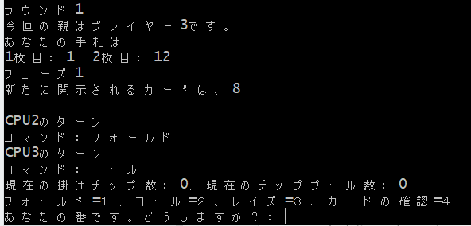

# Texas_Hold_em

# DEMO

The photo above shows the game in action. This game follows the rules of Texas Home Dem.

# Features

The reason for this is that we introduced the ability to think and make decisions based on the situation.

The reason for this is that we thought that a completely random decision would be difficult to make into a game.

First, we assumed that there would be no bugs or cheating, and we assigned scores to three elements: "the opponent's decision," "the combination of your hand," and "the combination of your hand and unrevealed cards." We then set a threshold for each total score and had the CPU decide whether to fold, call, or raise.

Also, since only numbers can be input, we set it to return an error if a number other than the one presented is entered.

# Requirement

* CommandPormpt

# Usage

Start the command prompt and change directory (cd) to the Texas_Hold_em.c folder in ExecuteFolder (executable file). Then enter "Texas_Hold_em.exe" to run it.

# Note

Unnecessary line breaks can cause errors.

# Author

* kenkyujiro
* kenkyujiro0229@outlook.jp

# License

"Texas_Hold_em" is under [MIT license](https://en.wikipedia.org/wiki/MIT_License).
